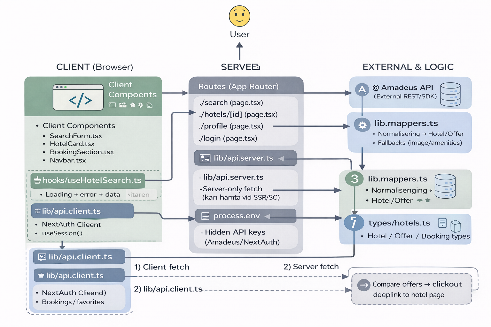

# Delivery 2 – Documentation and Technical Reflection

**Project:** StayEase (Hotel Finder / Booking App)
**Tech:** Next.js (App Router) + React + TypeScript + Tailwind + Amadeus API (or Mock)
**Course:** Framework & Component-based Development (Frontend)

---

## 1. Project Description and User Needs

### Summary

StayEase is a hotel booking-style application where users can search for hotels by city and dates, view results as hotel cards, navigate to a hotel details page, and manage bookings (simulated). The project demonstrates component-based development, routing, state handling, API integration, and basic testing.

### Target Audience

Users who want to quickly explore hotels in a specific city and compare options before deciding to proceed with a booking on a real provider’s website (or within a booking flow).

### Intended Use Cases

* Search for hotels by city and optionally check-in/check-out dates and number of guests.
* View search results with loading state (skeleton) and error handling.
* Click a hotel card to open a details page with more information and amenities.
* Create a simulated booking and review it in the profile section (if signed in).
* Sign in using Google or a demo user.

---

## StayEase – Hotel Booking Application (Project Overview)

StayEase is built with **Next.js (App Router)**, **TypeScript**, and **Tailwind CSS**. It features hotel search, a hotel details view, booking management (simulated), and authentication.

### Key Features

* **Search:** Find hotels by location, check-in/check-out dates, and guests.
* **Details:** View hotel description, amenities, and basic location info.
* **Booking (simulated):** Create bookings and view them in the profile section.
* **Authentication:** Sign in with Google or use a demo user for testing.
* **Responsive UI:** Mobile-first layout with a modern, clean design.

### Tech Stack

* **Framework:** Next.js 14 (App Router)
* **Language:** TypeScript
* **Styling:** Tailwind CSS
* **State Management:** Zustand
* **Authentication:** NextAuth.js
* **Testing:** Jest & React Testing Library
* **Icons:** React Icons
* **Animations:** Framer Motion

### Getting Started

Install dependencies:

```bash
npm install
```

Run the development server:

```bash
npm run dev
```

Open:

* `http://localhost:3000`

### API & Data

The application can run with a **Mock API** (`src/lib/api.ts`) to simulate external data fetching. This allows the app to work end-to-end without requiring API keys.

To switch to a real provider (e.g., **Amadeus**), you would:

1. Obtain an API key from the provider.
2. Update the app to call real endpoints (preferably via Next.js API routes).
3. Add environment variables in `.env.local`.

> Note: API routes are preferred when using real credentials to avoid exposing API keys and to reduce CORS-related issues.

### Authentication

For Google login, add credentials to `.env.local`:

```env
GOOGLE_CLIENT_ID=your-client-id
GOOGLE_CLIENT_SECRET=your-client-secret
NEXTAUTH_SECRET=your-secret-key
```

For demo/testing, the app supports a **“Sign in as Demo User”** option.

### Testing

Run tests with:

```bash
npm test
```

---

## 2. Architecture and Routing

### Pages and Navigation Structure

(Adjust the names if your final routes differ)

* `/` – Home (entry point / introduction / search shortcut)
* `/search` – Search results page (hotel list)
* `/hotels/[id]` – Hotel details page (dynamic route)
* `/login` – Authentication page
* `/profile` – Profile & bookings overview (authenticated users)

### Why This Structure

I chose **Next.js App Router** because it provides a clear folder-based routing structure and makes dynamic routing straightforward (e.g., `/hotels/[id]`). It also supports API routes within the same project, which fits well for external API integration and keeping secrets server-side.

---

## 3. Component Structure

### Core Components

(Example list—adapt to your repo)

* `Navbar` – Main navigation and active link state
* `SearchForm` – Search input (city, dates, guests)
* `SearchResults` – Result list rendering + empty/error/loading states
* `HotelCard` – Reusable card component used to display hotel information
* `BookingSection` – Booking UI (simulated) on the hotel details page
* `StarRating` / UI components – Small reusable UI parts

### Example Reusable Component: `HotelCard`

`HotelCard` is reusable and used wherever hotels are displayed (search list and potentially profile/favorites). It receives a typed `Hotel` object via props and is responsible only for rendering and navigation interaction, not for data fetching. This separation makes the component reusable and easier to test.

---

## 4. State Management and Hooks

### Local State (What and Why)

Local state is used for UI-specific concerns that don’t need to be shared globally, such as:

* Form inputs
* UI toggles (open/close menu)
* Component-level loading states (if not handled centrally)

### Global State (What and Why)

Global state (e.g., Zustand) is suited for data shared across multiple parts of the app, such as:

* Bookings / saved items
* User session-related UI behavior
* Shared search filters or “last search” (if used across pages)

### Custom Hook (Requirement)

A custom hook (e.g., `useHotelSearch`) was created to encapsulate:

* Fetching data from the API route
* Handling loading state (including skeleton UI)
* Handling errors
* Returning the final hotel results

**Why a hook?**
Hooks help separate logic from UI. This reduces duplication (same fetching logic in multiple components), improves readability, and makes it easier to test or refactor later.

---

## 5. Code Structure and Project Organization

### Folder Structure (Example)

* `src/app/` – Pages/routes using Next.js App Router
* `src/app/api/` – API routes (server-side integration)
* `src/components/` – Reusable UI and feature components
* `src/hooks/` – Custom hooks (e.g., `useHotelSearch`)
* `src/lib/` – API helpers, utilities, transformations
* `src/types/` – TypeScript types/interfaces (`Hotel`, etc.)

### Why This Organization

The goal was to keep responsibilities clear:

* UI components focus on rendering and interactions
* Hooks and lib functions encapsulate data-fetching logic and transformations
* API routes isolate external API integrations and keep secrets secure

---

## 6. Testing

### What I Tested and Why

* **Component tests** for reusable UI components (e.g., Button renders correctly, handles click events, and applies the correct variant styling).

These tests verify core UI behavior such as accessibility (rendering with correct role and label), interaction (click handling), and visual consistency (Tailwind variant classes).

These tests provide quick feedback during development and help prevent regressions when refactoring shared UI components that are used across multiple pages.

### What I Would Test Next

* Tests for the custom hook (`useHotelSearch`) with mocked `fetch` calls
* Integration test of the full flow: search → results → click card → details page
* API route tests with mocked Amadeus responses to validate transformations and error handling

---

## 7. Technical Choices, Trade-offs, and Reflection

### Why Next.js + React + TypeScript

* React supports component-based architecture and reusable UI patterns.
* Next.js App Router provides built-in routing and server capabilities (API routes).
* TypeScript adds type safety and helps keep a consistent `Hotel` model from API to UI.

### API Choice and Limitations

The project integrates with a hotel search API (Amadeus). A trade-off is that external APIs often have limitations (e.g., incomplete data such as missing images/ratings or inconsistent fields). To handle this, I implemented fallbacks (default images, simplified rating, safe optional chaining).

### Server vs Client Trade-off

I used **Next.js API routes** as a server layer between the client and the external API:

* **Pros:** protects API keys, reduces CORS issues, allows consistent response transformation
* **Cons:** adds an extra layer of code and complexity

### Short-term vs Long-term Impact

* Short-term: slower to implement because the data flow must be correct (URL → hook → API route → transformation → UI).
* Long-term: easier to maintain, test, and extend (switch provider, add caching, improve booking).

### What I Would Improve in a New Iteration

* Improve images by combining providers or maintaining a mapping dataset
* Stronger error handling and UX for edge cases
* Add caching strategies for repeated searches
* Further simplify and standardize data transformation logic

Write more of:
* Scalability? Be more clearer on WHY (underhållbarhet?) trade-offs?

---

## Note on AI Tools

I used AI tools primarily as support for debugging and exploring solution alternatives—especially for issues related to Next.js dynamic routing (`/hotels/[id]`), server/client boundaries, and API integration with Amadeus (choosing the correct SDK method and aligning request/response formats).

To ensure I understood and controlled the code, I always validated suggestions by reading terminal errors, testing the full user flows locally (search → click → details page), inspecting API responses, and refactoring the final implementation into a structure I can explain and defend during code review.

---

# Appendix (Optional) – How to Run Locally (Quick)

```bash
npm install
npm run dev
```

Open:

* `http://localhost:3000`

Tests:

```bash
npm test
```


